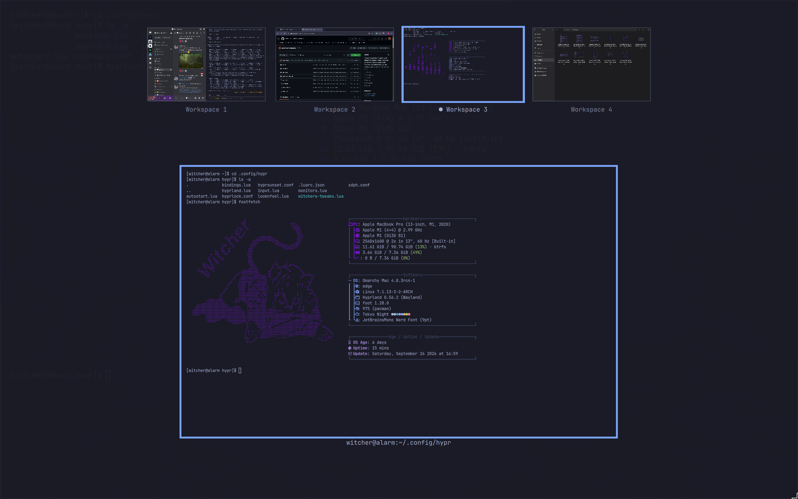
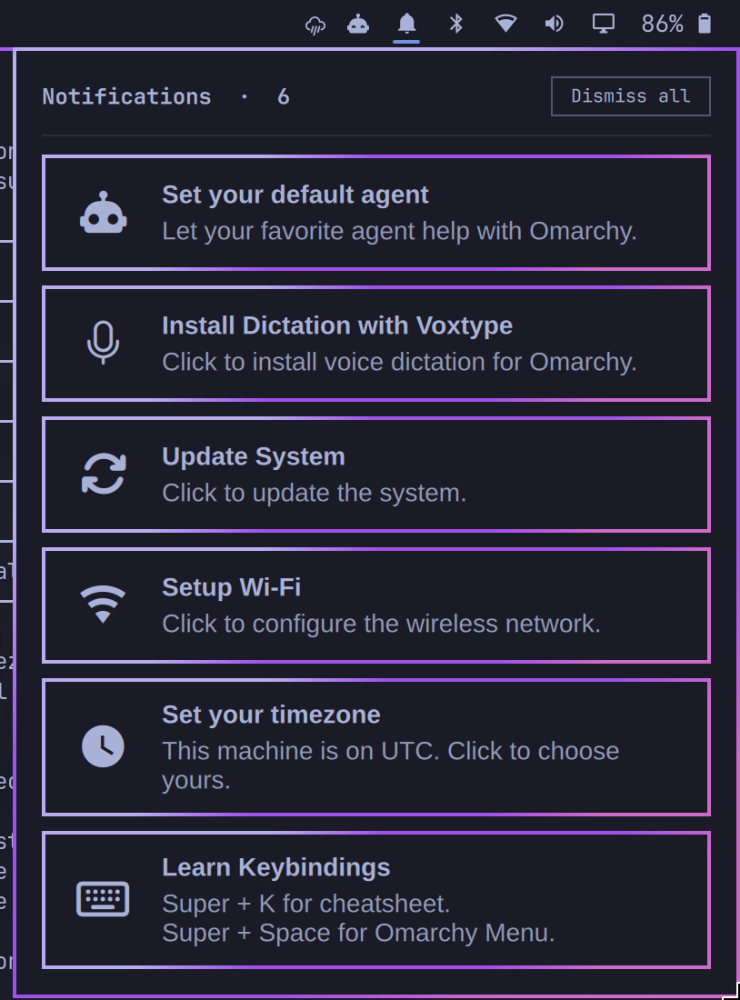
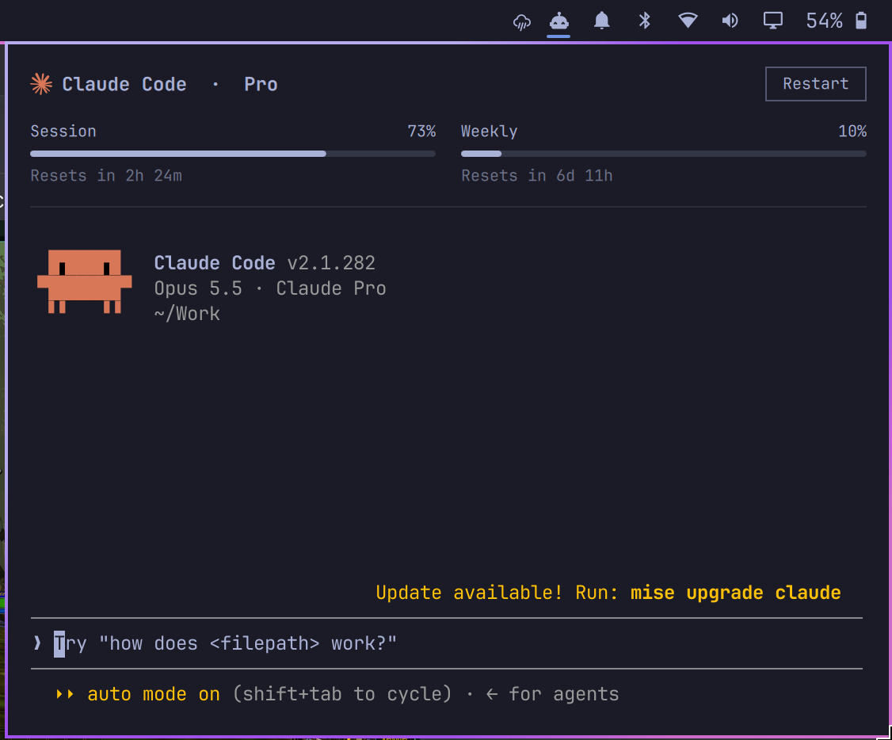
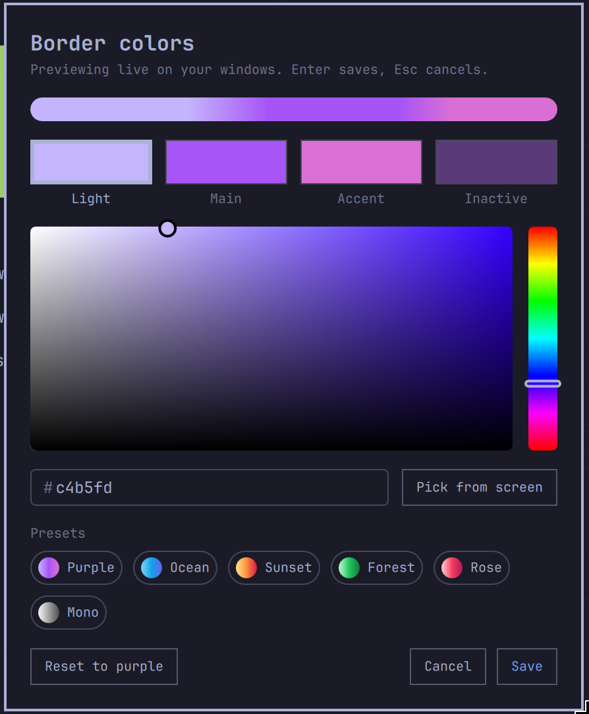
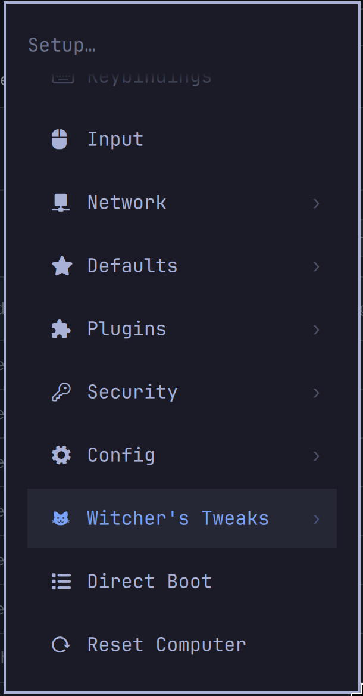

# Witcher's Tweaks

Optional tweaks for [Omarchy](https://omarchy.org): a Mission Control-style
window overview, a notification bell, a spinning gradient border in colors you
pick, macOS-like swipes, suspend on idle and more. Every tweak can be added,
configured and safely removed on its own, from the terminal or from
**Setup > Witcher's Tweaks** in the Omarchy menu.

Nothing is replaced wholesale: your own Hyprland files (`input.lua`,
`bindings.lua`, `looknfeel.lua`) are never touched, and removing a tweak puts
back exactly what it changed.

Tested on Omarchy with Hyprland 0.56 (Lua config) and Quickshell 0.3. Some
tweaks lean on Omarchy internals (the shell's plugin API, its notification
service, the menu format), so a future Omarchy release could break one; open
an issue if it does.

<p align="center">
  <a href="docs/screenshots/overview.png"></a>
  <a href="docs/screenshots/notifications.png"></a>
  <a href="docs/screenshots/agentchat.png"></a>
  <br>
  <sub>Window overview · Notification bell · Agent widget (click for full size)</sub>
</p>

## Install

```bash
git clone https://github.com/xxwitcher/witchers-tweaks.git ~/witchers-tweaks
~/witchers-tweaks/install.sh
```

The installer goes category by category (Look, Input, Keybindings, Top bar,
Notifications, Windows, Power, Hardware) and lets you pick individual tweaks
from each; nothing is picked by default. It uses `gum`, which ships with
Omarchy, and falls back to y/n prompts without it. Afterwards the same menu
lives in **Setup > Witcher's Tweaks** (right under Config): **Add**,
**Remove** and **Configure**.

```bash
./install.sh                     # pick tweaks category by category
./install.sh --add [tweak...]    # add tweaks (asks which, from those not installed)
./install.sh --remove [tweak...] # remove tweaks (asks which, then confirms)
./install.sh --configure [name]  # monitors, borders, corners, suspend, notifications, dock
./install.sh --status            # which tweaks are installed
./install.sh --list              # every tweak, by category
./install.sh --all               # every tweak this machine can use
./install.sh --uninstall         # remove everything, including the menu entry
./install.sh --monitors          # the interactive monitor setup
SUSPEND_MINUTES=10 ./install.sh suspend            # without the question
NOTIFY_SECONDS=8 ./install.sh --configure notifications
DOCK_SIZE=56 DOCK_MAGNIFICATION=96 DOCK_TRANSPARENCY=20 ./install.sh --configure dock
WINDOW_ROUNDING=10 ./install.sh rounding
```

Keep the clone: installed files link back into it, and `git pull` updates
them. Tweaks that don't apply to the machine (battery percentage without a
battery, the Touch Bar without tiny-dfr) aren't offered.

## The tweaks

| Category | Tweak | What it does |
|---|---|---|
| Look | `gaps` | No gaps between windows |
| Look | `border` | Spinning three-color gradient border on windows, bar popups, notifications and the lock screen; colors picked in Configure > Borders |
| Look | `rounding` | Window corner rounding, 0 (sharp, Omarchy's default) to 24 px, set on a slider in Configure > Corners with a live preview |
| Look | `wsfade` | Workspaces slide in with a fade instead of switching instantly |
| Look | `columns` | Scrolling layout: one column per screen instead of two |
| Input | `swapkeys` | Swap left Ctrl and left Super (right-hand keys stay) |
| Input | `swipe` | 3-finger swipe between workspaces, tuned like macOS: a short swipe or quick flick is enough |
| Keybindings | `bindbrowser` | SUPER+B opens the browser (instead of SUPER+SHIFT+B) |
| Keybindings | `bindagent` | SUPER+A opens your default agent (instead of SUPER+SHIFT+A) |
| Keybindings | `bindclose` | CTRL+Q closes the window |
| Top bar | `autohide` | The bar hides until the cursor touches the top edge |
| Top bar | `clock` | Clock in the middle of the bar |
| Top bar | `battery` | Battery percentage next to the battery icon |
| Top bar | `bell` | Bell that opens recent notifications; dismiss each with its ✕, or all at once |
| Top bar | `agentchat` | The agent widget with your default agent's real terminal inside it |
| Notifications | `notifytimeout` | Every notification leaves after a few seconds (5 by default), critical ones too |
| Windows | `overview` | Mission Control-style overview: workspaces along the top, the hovered one's windows below; 3-finger swipe up |
| Windows | `dock` | A dock like macOS's: the Apps icon (a panel above the dock with every app in rows of five and a search field, like macOS's Apps view: type to search, arrows and Enter to open, drag an app onto the dock to keep it, right click for Keep in Dock, Open at Login and Remove), kept apps, then running and recently closed ones, then minimized windows, Downloads and the Trash. Drag icons to arrange them, drag a running app among the kept ones to keep it, drag a kept one out of the dock to remove it from the dock, or drop any app (from the dock or the Apps panel) on the Trash to uninstall it after a confirmation. Right click for the app's windows, Keep in Dock, Open at Login, Show All Windows, Hide and Quit. SUPER+M minimizes the focused window. Configure > Dock lists every setting with its current value; pick one to change it: macOS's Desktop & Dock settings (size, magnification, position, minimize into application icon, automatically hide and show or only when a window is under it, animate opening applications, indicators, recent apps), what clicking the app you're in does, dock and app drawer transparency and corner rounding (sliders with a live preview), and the dock's border: the windows' gradient, custom gradient colors, one solid color, or none |
| Power | `suspend` | No screensaver; suspend after 1, 5, 10, 15, 30 or 60 idle minutes |
| Hardware | `smidriver` | Silicon Motion SM77x USB display adapter driver, on evdi-dkms, with a crash fix |
| Hardware | `touchbar` | Touch Bar layout and screenshot key (MacBooks running tiny-dfr) |

### Configure

<a href="docs/screenshots/bordercolors.png"></a>
<a href="docs/screenshots/menuentry.png"></a>

**Setup > Witcher's Tweaks > Configure** (or `./install.sh --configure`)
offers:

- **Monitors**: resolution and refresh rate, scale, rotation, position,
  mirroring and on/off for each screen. A number shows on every screen; each
  change applies live and reverts by itself unless confirmed within 15
  seconds. Saved to a marked block at the end of `~/.config/hypr/monitors.lua`,
  matched by monitor model.
- **Borders** (with `border`): a color picker for the gradient's three colors
  and the inactive border (saturation/brightness square, hue strip, hex field,
  eyedropper, presets), previewed live on your windows. Enter saves, Esc
  cancels.
- **Suspend** (with `suspend`) and **Notifications** (with `notifytimeout`):
  how long to wait.

## How it works

- **Hyprland tweaks** are all in `home/.config/hypr/witchers-tweaks.lua`,
  linked to `~/.config/hypr/` and loaded by one marked block at the end of
  your `~/.config/hypr/hyprland.lua`. Each runs only while its name is in
  `~/.config/witchers-tweaks/tweaks.conf`. The block and the file go away with
  the last Hyprland tweak.
- **Shell tweaks** are Omarchy shell plugins (`home/.config/omarchy/plugins/
  witcher.*`), linked into `~/.config/omarchy/plugins/`. Bar placement and
  plugin settings are edited in place in `~/.config/omarchy/shell.json`.
- **Border colors** are kept in `~/.config/witchers-tweaks/border.conf`; the
  picker's `bin/border-colors` also writes
  `~/.config/omarchy/themed/shell.hyprland.toml.tpl` so the shell's popups,
  notifications and lock screen share the gradient.
- **System files** (the Touch Bar config, the SMI driver) are installed as
  root, with the original kept as `.bak`.
- **The menu entry** is a marked block in
  `~/.config/omarchy/extensions/omarchy-menu.jsonc`. Omarchy lists its own rows
  first, so to sit under Config the block also hides the Setup rows after
  Config (Direct Boot, Reset Computer) and re-adds copies below it, rebuilt
  from Omarchy's menu on every run.

### Removing

`--remove` undoes a tweak's steps in reverse. A linked file goes back to what
it replaced (its newest `.bak.<timestamp>`), or nothing; settings leave
`shell.json`; the auto-hide loop stops and the bar comes back; the screensaver
comes back with `suspend`; `border` rebuilds the theme without the gradient
and stops the spinning; `bell` deletes the notifications it saved;
`smidriver` runs SiliconMotion's uninstaller; `touchbar` restores the original
files. Packages a tweak pulled in (qmltermwidget, dkms, evdi-dkms, kernel
headers) stay installed. `--uninstall` removes every tweak, the Hyprland
loader and the menu entry.

## Notes

- `bindagent` and `bindbrowser` unbind Omarchy's SUPER+SHIFT+A and
  SUPER+SHIFT+B defaults.
- The overview's swipe up/down comes with `overview`; `swipe` is the
  sideways workspace swipe.
- `notifytimeout` drives Omarchy's own notification service rather than
  replacing it, so Do Not Disturb and history keep working; unlike Omarchy's
  timer it doesn't pause while the pointer is over a toast.
- The SiliconMotion driver in `smidriver/driver/` is SiliconMotion's
  software (BSD-style license, see its `LICENSE`), from
  [SiliconMotion-Driver-Fix](https://github.com/xxwitcher/SiliconMotion-Driver-Fix).

## License

MIT, see `LICENSE`. `smidriver/driver/` keeps SiliconMotion's own license.

The agent widget (`witcher.agents`) is adapted from Omarchy's `omarchy.agents`
plugin, and its `Main.qml` and `Agent.qml` are copies of Omarchy's; the
notifications panel reuses Omarchy's notification card at runtime.
[Omarchy](https://github.com/basecamp/omarchy) is MIT licensed.
