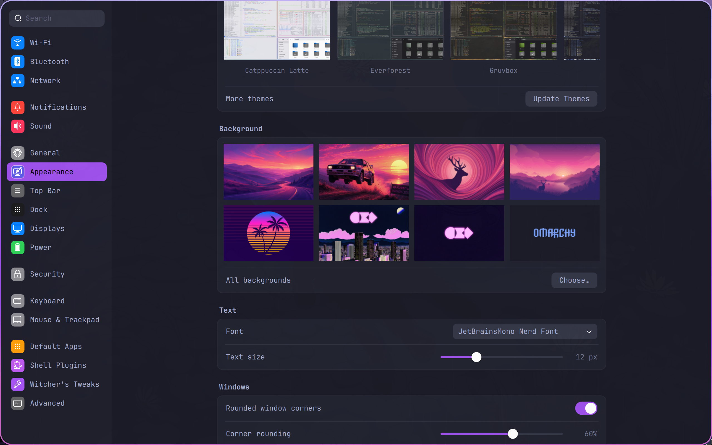
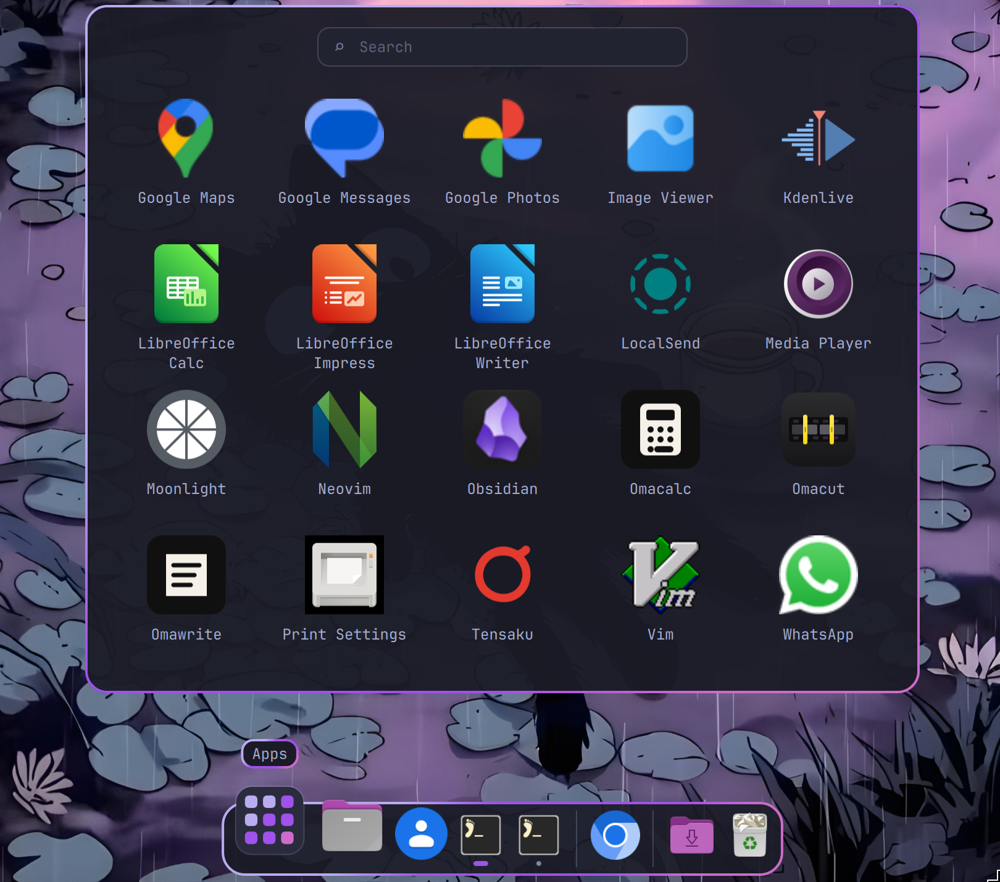
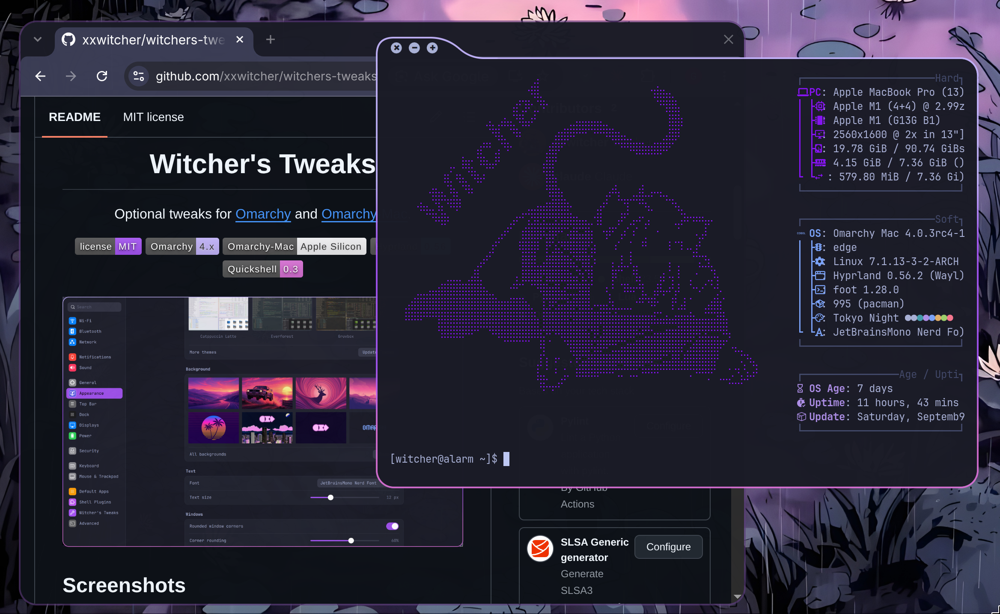

<div align="center">

# Witcher's Tweaks

Optional tweaks for [Omarchy](https://omarchy.org) and [Omarchy-Mac](https://github.com/omacom/omarchy-mac).

<p>
<a href="LICENSE"></a> <a href="https://omarchy.org"></a> <a href="https://github.com/omarchy-mac/omarchy-mac"></a> <a href="https://hypr.land"></a> <a href="https://quickshell.org"></a>
</p>

<a href="docs/screenshots/settings_app.png"></a>

</div>

## Screenshots

<table>
  <tr>
    <td width="50%"><a href="docs/screenshots/dock_and_app_drawer.png"></a></td>
    <td width="50%"><a href="docs/screenshots/overview.png"></a></td>
  </tr>
  <tr>
    <td align="center"><sub>Dock and app drawer</sub></td>
    <td align="center"><sub>Window overview</sub></td>
  </tr>
  <tr>
    <td><a href="docs/screenshots/notifications.png"></a></td>
    <td><a href="docs/screenshots/agentchat.png"></a></td>
  </tr>
  <tr>
    <td align="center"><sub>Notification bell</sub></td>
    <td align="center"><sub>Agent widget</sub></td>
  </tr>
</table>

## Install

```bash
git clone https://github.com/xxwitcher/witchers-tweaks.git ~/witchers-tweaks
~/witchers-tweaks/install.sh
```

Pick and choose the tweaks you want. Use **Setup > Witcher's Tweaks** in the Omarchy menu, or the Settings app to re-configure after install. Keep the clone: installed files link to it, and `git pull` updates them.

```bash
./install.sh --add [tweak...]      # add tweaks
./install.sh --remove [tweak...]   # remove tweaks
./install.sh --configure [name]    # monitors, borders, corners, suspend, notifications, dock
./install.sh --status              # what's installed
./install.sh --list                # every tweak
./install.sh --uninstall           # remove everything
./install.sh --tui                 # the installer in the terminal instead of the setup window
```

In a desktop session `./install.sh` opens a setup window: pick tweaks, set up the ones that have settings, install.

## Tweaks

| Tweak | What it does |
|---|---|
| `settings` | Settings app, like macOS's System Settings (see below) |
| `dock` | macOS-style dock with an app drawer (see below) |
| `titlebars` | macOS-style title bars on floating windows: close, minimize, maximize, drag to move. Builds the [hyprbars](https://github.com/hyprwm/hyprland-plugins) plugin for your Hyprland and rebuilds it after updates |
| `borderresize` | Resize floating windows by dragging their border; tiled windows are left alone |
| `overview` | Mission Control-style window overview; 3-finger swipe up |
| `border` | Animated three-color gradient border on windows, popups, notifications and the lock screen |
| `rounding` | Window corner rounding, 0–100% (same scale as the dock) |
| `gaps` | No gaps between windows |
| `wsfade` | Workspaces slide in with a fade |
| `columns` | Scrolling layout: one column per screen |
| `swipe` | macOS-like 3-finger workspace swipe |
| `swapkeys` | Swap left Ctrl and left Super |
| `bindbrowser` | SUPER+B opens the browser |
| `bindagent` | SUPER+A opens your default agent |
| `bindclose` | CTRL+Q closes the window |
| `autohide` | Top bar hides until the cursor touches the top edge |
| `clock` | Clock in the middle of the top bar |
| `battery` | Battery percentage in the top bar |
| `bell` | Notification bell with recent notifications |
| `agentchat` | Agent widget with your agent's terminal inside |
| `notifytimeout` | Notifications leave after a few seconds, critical ones too |
| `suspend` | Suspend after 1–60 idle minutes instead of the screensaver |
| `smidriver` | Silicon Motion SM77x USB display adapter driver, with a crash fix |
| `touchbar` | Touch Bar layout (MacBooks with tiny-dfr) |

### Settings app

A floating settings window with a searchable sidebar: Wi-Fi, Bluetooth, network, notifications, sound, general, appearance, top bar, dock, displays, power, security, keyboard, mouse and trackpad, default apps, shell plugins, the tweaks and config files. Tweaks you haven't installed show up as switches that install them. Opens with `witcher-settings [section]`.

Input settings and custom shortcuts go in `~/.config/witchers-tweaks/settings.json`; your Hyprland files aren't edited.

### Dock

Pinned, running and recent apps, minimized windows, Downloads and Trash. The Apps icon opens a searchable app drawer. Drag icons to rearrange, keep or remove them; drop an app on the Trash to uninstall it. SUPER+M minimizes into the dock with a genie, scale, fade or slide effect. Has macOS's Desktop & Dock options plus transparency, corner rounding and border colors.

### Window controls

<a href="docs/screenshots/xminmax.png"></a>

Hover the top-left corner of a floating window and a tab grows out of it with close, minimize and maximize. It follows your border gradient, corner rounding and the app's own color. Drag a floating window by its top edge. While a window is maximized, the three buttons sit in the top bar, between the Omarchy menu and the workspaces; + restores it. Minimize and restore play the dock's effect, and a restored window comes back on top.

## How it works

- Hyprland tweaks are in `home/.config/hypr/witchers-tweaks.lua`, loaded from the end of your `hyprland.lua` and switched on by `~/.config/witchers-tweaks/tweaks.conf`.
- Shell tweaks are Omarchy shell plugins (`witcher.*`) with their settings in `~/.config/omarchy/shell.json`.
- The Settings app is QML in `settings/`, using the Omarchy shell's own components.
- Removing a tweak restores what it replaced. Packages it installed stay installed.

## Compatibility

Developed on [Omarchy-Mac](https://github.com/omacom/omarchy-mac) and also works on a regular Omarchy install (Hyprland 0.56 with Lua config, Quickshell 0.3). Some tweaks rely on Omarchy internals, so an Omarchy update could break something in the future; [open an issue](https://github.com/xxwitcher/witchers-tweaks/issues) if it does.

## License

MIT. The agent widget is adapted from Omarchy's `omarchy.agents` plugin; [Omarchy](https://github.com/basecamp/omarchy) is MIT licensed.
